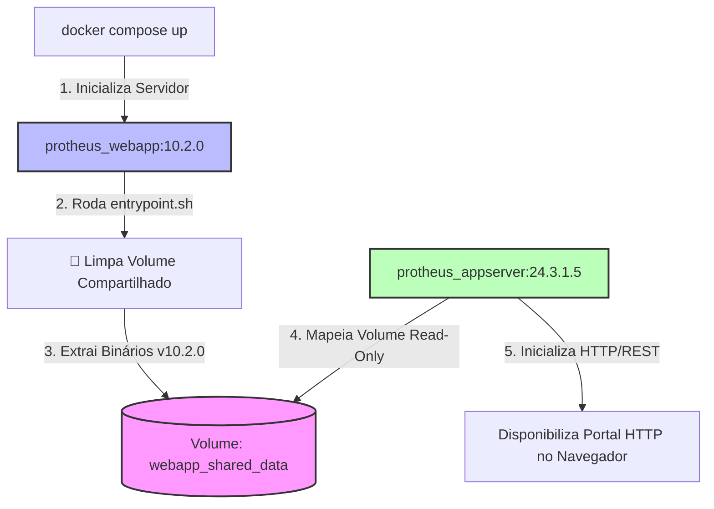

# 🐳 TOTVS Protheus - SmartClient HTML WebApp (Interface Module)

Este repositório é um componente isolado da arquitetura TOTVS Protheus Modern DevOps [https://github.com/rodrigomicrosiga-devops/totvs-protheus-modern-devops], e isola o ciclo de vida do componente **SmartClient WebApp** dentro da organização **`rodrigomicrosiga-devops`**. Ele funciona sob o padrão *Delivery/Sidecar Container*, desacoplando completamente as atualizações de interface visual do Kernel de execução do AppServer.

---

## 🏗️ Arquitetura de Entrega Dinâmica (Hot-Swap Delivery)

Ao invés de embutir os binários da WebApp estaticamente dentro da imagem do AppServer, este microsserviço limpa e injeta os componentes atualizados do HTML/JS dentro de um volume compartilhado em runtime.



### 🚀 Vantagens Técnicas do Desacoplamento
* **Atualização Zero-Downtime**: É possível atualizar a versão da interface de tela (ex: migrar de 10.2.0 para uma versão superior) substituindo apenas este container, sem a necessidade de reiniciar o AppServer principal ou derrubar conexões de usuários/Workers em background.

* **Pipeline Isolado**: O build da interface roda de forma independente, gerando imagens leves baseadas em Alpine Linux.

### 🏷️ Rastreabilidade de Build

A tag da imagem publicada permanece fixa entre builds — só muda em uma nova release de versão. Para rastrear qual commit gerou um build específico sem depender da tag, o `pipeline` grava o label `org.opencontainers.image.revision` com o SHA do commit em toda imagem publicada:

```bash
docker inspect --format '{{ index .Config.Labels "org.opencontainers.image.revision" }}' rodrigomicrosiga/webapp-dev:10.2.1
```